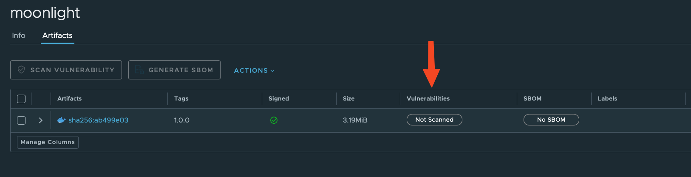
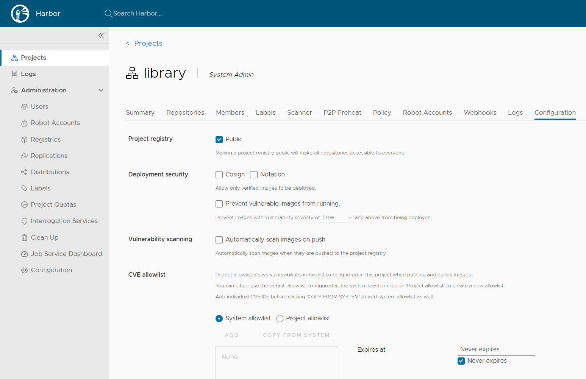
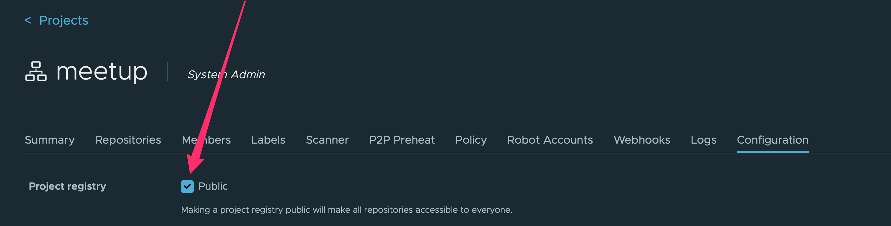

# Build Trust - Build Secure: Using Open Source Security Tools

## 0. Pre-requisites


## 0.1 Offline setup

For doing the workshop exercises offline we'll need a Virtual Machine based on `Ubuntu 24.04`. We can create one, using
any of the freely available desktop hypervisors:

Free and Open Source:

- [VirtualBox](https://www.virtualbox.org)

Free for personal use:
> Note: Both VMware Workstation Pro and Fusion Pro are now free for personal use. More details you can find [here](https://blogs.vmware.com/workstation/2024/05/vmware-workstation-pro-now-available-free-for-personal-use.html)

- [VMware Workstation Pro](https://support.broadcom.com/group/ecx/productdownloads?subfamily=VMware+Workstation+Pro)
- [VMware Fusion Pro](https://support.broadcom.com/group/ecx/productdownloads?subfamily=VMware+Fusion)

Build-in Virtualization:

- Hyper-V in Windows 11 Pro or Enteprise
- KVM/XEN in Linux Desktops

To save some time (and effort), we can use [Vagrant](https://www.vagrantup.com) to automate the creation of the VM.
Vagrant by HashiCorp is an easy to use tool that allow us to quickly create a Virtual Machine based development
environments using automation.

> Note: We are not going to spend much time explaining Vagrant in details here, but if you have any questions/problems
> please ask.

If you want to learn more about Vagrant a good starting point is their [Get Started](https://developer.hashicorp.com/vagrant/tutorials/getting-started)
tutorial.

## 0.2 Lab VM setup using Vagrant

- Install [Vagrant](https://developer.hashicorp.com/vagrant/docs/installation)
- Make sure your desktop Virtualization software is configured
- Create a `Vagrantfile`
- Run `vagrant up` and wait for the VM to be up and running.

Lets start by creating the Vagrantfile:

```shell
~$ cat Vagrantfile
```

```ruby
Vagrant.configure("2") do |config|
  config.vm.box = "bento/ubuntu-24.04"
  config.vm.box_version = "202404.26.0"
end
```

More details about the Vagrant Box that we'll be using you can find  [here](https://app.vagrantup.com/bento/boxes/ubuntu-24.04)
Next, we are going to create the lab VM using `vagrant up`:

> Note: The output on your machine might differ based on the platform and hypervisor you are using

```bash
~$ vagrant up
```

```shell
Bringing machine 'default' up with 'vmware_desktop' provider...
==> default: Box 'bento/ubuntu-24.04' could not be found. Attempting to find and install...
    default: Box Provider: vmware_desktop, vmware_fusion, vmware_workstation
    default: Box Version: 202404.26.0
==> default: Loading metadata for box 'bento/ubuntu-24.04'
    default: URL: https://vagrantcloud.com/api/v2/vagrant/bento/ubuntu-24.04
==> default: Adding box 'bento/ubuntu-24.04' (v202404.26.0) for provider: vmware_desktop (arm64)
    default: Downloading: https://vagrantcloud.com/bento/boxes/ubuntu-24.04/versions/202404.26.0/providers/vmware_desktop/arm64/vagrant.box
==> default: Successfully added box 'bento/ubuntu-24.04' (v202404.26.0) for 'vmware_desktop (arm64)'!
==> default: Cloning VMware VM: 'bento/ubuntu-24.04'. This can take some time...
==> default: Checking if box 'bento/ubuntu-24.04' version '202404.26.0' is up to date...
==> default: Verifying vmnet devices are healthy...
==> default: Preparing network adapters...
==> default: Starting the VMware VM...
==> default: Waiting for the VM to receive an address...
==> default: Forwarding ports...
    default: -- 22 => 2222
==> default: Waiting for machine to boot. This may take a few minutes...
    default: SSH address: 127.0.0.1:2222
    default: SSH username: vagrant
    default: SSH auth method: private key
    default:
    default: Vagrant insecure key detected. Vagrant will automatically replace
    default: this with a newly generated keypair for better security.
    default:
    default: Inserting generated public key within guest...
    default: Removing insecure key from the guest if it's present...
    default: Key inserted! Disconnecting and reconnecting using new SSH key...
==> default: Machine booted and ready!
==> default: Configuring network adapters within the VM...
==> default: Waiting for HGFS to become available...
==> default: Enabling and configuring shared folders...

~$
```

```shell
~$ vagrant box list
bento/ubuntu-24.04 (vmware_desktop, 202404.26.0, (arm64))

~$ vagrant status default
Current machine states:

default                   running (vmware_desktop)

The VM is running. To stop this VM, you can run `vagrant halt` to
shut it down, or you can run `vagrant suspend` to simply suspend
the virtual machine. In either case, to restart it again, run
~$
```

```shell
~$ vmrun list

Total running VMs: 1
Total running VMs: 1
~/dojolabs/.vagrant/machines/default/vmware_desktop/172785f5-4122-4d7e-968d-29e49243385b/ubuntu-24.04-aarch64.vmx
~$
```

Now we have our Linux machine lets ssh inside it. With `vagrat` is very simple just use the command below:

```bash
~/demo$ vagrant ssh

Welcome to Ubuntu 24.04 LTS (GNU/Linux 6.8.0-31-generic aarch64)

 * Documentation:  https://help.ubuntu.com
 * Management:     https://landscape.canonical.com
 * Support:        https://ubuntu.com/pro

 System information as of Thu Jul  4 11:04:26 AM UTC 2024

  System load:  0.0                Processes:             252
  Usage of /:   10.7% of 29.82GB   Users logged in:       0
  Memory usage: 3%                 IPv4 address for eth0: 192.168.59.149
  Swap usage:   0%
```

## 0.2.1 Clone the workshop GIT repository

Lets clone the repo with all the necessary files

```bash
~$ git clone https://github.com/DojoBits/web-build-trust-2024-jul.git
Cloning into 'web-build-trust-2024-jul'...

```

Lets move the demo directory to our home directory and change to it.

```bash
~$ mv web-build-trust-2024-jul/demo .
~$ cd demo/
~/demo$
```

## 0.3 Install Cosign

Before we continue we'll do a small VIM configuration change:

```bash
$ echo "set number" >> ~/.vimrc
$ echo "set paste" >> ~/.vimrc
$
```

`cosign` is a tool for signing and verifying container images. We will use it in a moment to sign our images. We'll
install it using the latest release package from the GitHub:

```bash
# dkpg get machine arch
ARCH=$(dpkg --print-architecture)
# Install latest cosign
LATEST_VERSION=$(curl https://api.github.com/repos/sigstore/cosign/releases/latest | grep tag_name | cut -d : -f2 | tr -d "v\", ")
curl -O -L "https://github.com/sigstore/cosign/releases/latest/download/cosign_${LATEST_VERSION}_${ARCH}.deb"
sudo dpkg -i cosign_${LATEST_VERSION}_${ARCH}.deb
```

## 0.4 Install Kubernetes

We will use a simple script to install `kubernetes` and `cilium` on our VM. Lets first download and review the script
in order to make sure it does what we intend:

```shell
~$ wget -q - https://raw.githubusercontent.com/DojoBits/Toolbox/main/k8s-up.sh
~$ cat k8s-up.sh
```

```bash
#!/usr/bin/env bash

set -e

# Global Defaults

K8S_VER="v1.30"
K8S_VER_MIN="1"
CRI_VER="v1.30.0"
CIL_VER="1.15.5"


# Detect OS arch

arch=$(uname -m)

...

# Remove the taints

kubectl patch node "$(hostname)" -p '{"spec":{"taints":[]}}'
$
```

The script uses `containerd` as a container runtime which means `Docker` will not be installed. We will do that in the
next step.


```bash
~$ sh k8s-up.sh

net.bridge.bridge-nf-call-ip6tables = 1
net.bridge.bridge-nf-call-iptables = 1
net.ipv4.ip_forward = 1
* Applying /usr/lib/sysctl.d/10-apparmor.conf ...
* Applying /etc/sysctl.d/10-console-messages.conf ...
* Applying /etc/sysctl.d/10-ipv6-privacy.conf ...
* Applying /etc/sysctl.d/10-kernel-hardening.conf ...
* Applying /etc/sysctl.d/10-magic-sysrq.conf ...
* Applying /etc/sysctl.d/10-map-count.conf ...
* Applying /etc/sysctl.d/10-network-security.conf ...

...

cilium-linux-amd64.tar.gz: OK
cilium
node/vagrant patched
~$
```

## 0.5 Install Docker

We will use `Docker` to build our container images and push them to the `Harbor` registry. Because we already have the
correct APT repository for `Docker` we can install it with the following command.

```bash
~$ sudo apt-get install docker-ce docker-ce-cli docker-buildx-plugin docker-compose-plugin -y
Reading package lists... Done
Building dependency tree... Done
Reading state information... Done
The following additional packages will be installed:
  docker-ce-rootless-extras libltdl7 libslirp0 pigz slirp4netns
Suggested packages:
  cgroupfs-mount | cgroup-lite
The following NEW packages will be installed:
  docker-buildx-plugin docker-ce docker-ce-cli docker-ce-rootless-extras
  docker-compose-plugin libltdl7 libslirp0 pigz slirp4netns
0 upgraded, 9 newly installed, 0 to remove and 64 not upgraded.
Need to get 75.3 MB of archives.
After this operation, 278 MB of additional disk space will be used.
Do you want to continue? [Y/n] y
Get:1 http://ports.ubuntu.com/ubuntu-ports noble/universe arm64 pigz arm64 2.8-1 [60.7 kB]
Get:2 https://download.docker.com/linux/ubuntu noble/stable arm64 docker-buildx-plugin arm64 0.15.1-1~ubuntu.24.04~noble [27.3 MB]
Get:3 http://ports.ubuntu.com/ubuntu-ports noble/main arm64 libltdl7 arm64 2.4.7-7build1 [40.4 kB]
...
...
Processing triggers for man-db (2.12.0-4build2) ...
Processing triggers for libc-bin (2.39-0ubuntu8.1) ...
Scanning processes...
Scanning linux images...

Running kernel seems to be up-to-date.

No services need to be restarted.

No containers need to be restarted.

No user sessions are running outdated binaries.

No VM guests are running outdated hypervisor (qemu) binaries on this host.
```

Lets add our user to the docker group so we don't use `sudo` all the time.

```bash
~/demo$ sudo usermod -aG docker $(whoami)
~/demo$ newgrp docker
```

If you like auto-completion, don't forget this which will do two things. Remember this is the first thing in the
kubernetes [kubectl Quick Reference](https://kubernetes.io/docs/reference/kubectl/quick-reference/).

- Add the completion script to your `.bashrc` file
- Add an alias for `kubectl` to `k` ( optional ). If you don't want to use 'k' just use the full command `kubectl`.

```bash
echo "source <(kubectl completion bash)" >> ~/.bashrc
echo "alias k=kubectl" >> ~/.bashrc
echo "complete -F __start_kubectl k" >> ~/.bashrc
source ~/.bashrc
```

Lets verify the Kubernetes installation:

```bash
~/demo$ k get nodes
NAME     STATUS   ROLES           AGE     VERSION
ubuntu   Ready    control-plane   3m49s   v1.30.3

~/demo$
```

Everything looks good.

## 1.0 Harbor Registry

We will use the official Harbor [Live Demo Environment](https://demo.goharbor.io/)

> Note: According to the [Harbor documentation](https://goharbor.io/docs/1.10/install-config/demo-server/)
> __The demo server is cleaned and reset every two days.__ .We can use that instance only for tests purposes.

Lets create an account in Harbor.

Click on the `Sign up for an account` link underneath the `LOG IN` button, and fill the form with a username, password
and e-mail address.

> Note: The data that you provide is not validated. There is no need to provide a valid e-mail address here.

For our demo we will setup a user `dojobits` and a password `HarborDemo123!.` that will be removed after the end of the
demo.

Next, we'll create a new project in Harbor. Projects in Harbor contains all repositories of an application. We cannot
push an images to Harbor before we create a project.

Click on the `NEW PROJECT` button, underneath the `Projects` page. In the `New Project` pop-up, enter the project
name: `harbordemo` and click `OK`.


## 1.1 Docker login to Harbor registry

To push images to the Harbor registry we need to login first. We will log-in using our account username `dojobits` and
password `HarborDemo123!.`

```bash
~/demo$ docker login demo.goharbor.io
Username: dojobits
Password:
WARNING! Your password will be stored unencrypted in /home/ubuntu/.docker/config.json.
Configure a credential helper to remove this warning. See
https://docs.docker.com/engine/reference/commandline/login/#credentials-store

Login Succeeded

~/demo$
```

We are now logged in.

## 1.2 Create an image

Next we will build a simple Docker image based on `alpine` Linux and tag it.

> Note: Currently there are no known critical vulnerabilities in the version of the alpine Linux base image that we'll use.

We'll build our image using the `Dockerfile` located in the `docker` folder inside the repository.

```bash
~/demo$ cd docker
~/demo/docker$ cat Dockerfile
FROM alpine:3.20.1
ENTRYPOINT ["sleep", "1000"]

~/demo/docker$
```

Lets build the image:

```bash
~/demo/docker$ docker build -t demo.goharbor.io/harbordemo/moonlight:1.0.0 .
[+] Building 2.8s (5/5) FINISHED                                                                               docker:default
 => [internal] load build definition from Dockerfile                                                                     0.0s
 => => transferring dockerfile: 85B                                                                                      0.0s
 => [internal] load metadata for docker.io/library/alpine:3.20.1                                                         2.2s
 => [internal] load .dockerignore                                                                                        0.0s
 => => transferring context: 2B                                                                                          0.0s
...
 => => writing image sha256:4e8e422ba5ff343afadffe92fe6c5176f3c4fe96bcd92c96fd23987b462f7ed7                             0.0s
 => => naming to demo.goharbor.io/harbordemo/moonlight:1.0.0                                                             0.0s
~/demo/docker$
```

Once the image build is complete we can view it:

```shell

~/demo/docker$ docker images
REPOSITORY                              TAG       IMAGE ID       CREATED       SIZE
demo.goharbor.io/harbordemo/moonlight   1.0.0     4e8e422ba5ff   5 weeks ago   8.83MB

~/demo/docker$
```

> Note: as we are not making any changes on top of the base image, the `CREATED` date for our new image will be the one
> of the base image.

## 1.3 Push the Docker image to Harbor registry

After we've build the image, let's push it to our image repository in the Harbor registry:

```bash
~$ docker push demo.goharbor.io/harbordemo/moonlight:1.0.0

The push refers to repository [demo.goharbor.io/harbordemo/moonlight]
b09314aec293: Pushed
3.0.0: digest: sha256:eb6b7c17ba2ece109f5548e95a90a0b104bc44aeb1f8b30b9eafa2e5de1c420c size: 527

~$
```

Now lets check the `Harbor` UI and check our new image. Open the [Harbor Registry](https://demo.goharbor.io/) and
navigate to our `harbordemo` project. Inside you should see the repository for the image that we've just
pushed: `harbordemo/moonlight`. Click on it to see the list of all images.

Is it signed or scanned ?

Lets see how we can change that!


## 2.0 Sign the docker image

To sign our image we'll now use Cosign cli that we've installed earlier. Cosign support multiple ways to sign images:

- Keyless - using ephemeral keys generated with OpenID Connect (OIDC) tokens
- Self-Managed Keys
- Hardware tokens

In this demo for simplicity we'll use the Cosign `Self-Managed` keys approach.

Lets generate a key pair using the cosign cli:

> Note: Please remember the password that you use here as you will need it later on
> For the demo we'll use a simple, insecure but easy to remember password to protect the keys: `314159`.

```bash
~/demo$ cosign generate-key-pair

Enter password for private key: 314159
Enter password for private key again: 314159
Private key written to cosign.key
Public key written to cosign.pub
~/demo$
```

Before we sign the image, lets discuss how to identify the image that we actually want to sign. We could use the image
tag or the image digest. As you know, image tags are immutable and they point to specific image. You cannot change the
tag to point to a different image. The problem is you `can delete` and `create a new tag` with the `same name` and
`point to a different image`. The digest is a `sha256` hash of the image and it is unique for each image. You cannot
change the digest of an image. This is why we will use the `image digest` instead to sign the image.


We will get the image digest and store it in a variable for later use.

```bash
~/demo$ DIGESTS=`docker images --digests | grep moonlight | grep 1.0.0 | awk '{print $3}'`
~/demo$ echo $DIGESTS
sha256:eb6b7c17ba2ece109f5548e95a90a0b104bc44aeb1f8b30b9eafa2e5de1c420c
```

Next, we'll sign the image using the `cosign` private key we've generated:

```bash
~/demo$ cosign sign --key cosign.key demo.goharbor.io/harbordemo/moonlight@${DIGESTS}
Enter password for private key:
WARNING: "demo.goharbor.io/harbordemo/moonlight" appears to be a private repository, please confirm uploading to the transparency log at "https://rekor.sigstore.dev"
Are you sure you would like to continue? [y/N] y
...
By typing 'y', you attest that (1) you are not submitting the personal data of any other person; and (2) you understand and agree to the statement and the Agreement terms at the URLs listed above.
Are you sure you would like to continue? [y/N] y
tlog entry created with index: 117045608
Pushing signature to: demo.goharbor.io/harbordemo/moonlight

~/demo$
```

If you want to validate the cosign signature record we can open the [Rekor Search](http://search.sigstore.dev) web ui.
There we can use the email address (if we use OIDC) or the `tlog` index entry from the output of the `cosign sign` command.
In our case that is `117045608`.

Lets try it out! In the `Rekor Search` Web UI, select `Log Index` from the `Attribute` drop-down menu and paste the tlog
index number in the "Log Index" field.

Lets take another look at our image in Harbor. Open [Harbor](https://demo.goharbor.io/) and navigate to our project
`harbordemo` and the image repository `harbordemo/moonlight`. Harbor now shows a green check in the `Signed` column,
confirming that our image is indeed signed.


## 2.1 Scanning images with Harbor

You can see that the image is not scanned  we can scan the image manually or make a
configuration in `Harbor` to scan the image on push. Bare with us we will do that in the next steps.

## 2.2 Build vulnerable image

Lets build an image with vulnerable software. We will use `Dockerfile-vuln` which use older `alpine` image which is
vulnerable

```bash
~/demo$ docker build -f Dockerfile-vuln -t demo.goharbor.io/harbordemo/moonlight-vuln:1.0.0 .
```

Push the images to your project in Harbor.

```
~$ docker push demo.goharbor.io/harbordemo/moonlight-vuln:1.0.0
Pushing image to demo.goharbor.io/harbordemo/moonlight-vuln:1.0.0
```

Let's check some `Harbor` project settings and:



- Keep the registry private or make it public
- Allow only signed images to be pulled with `cosign` or `Notation` a.k.a. `notary`
- Prevent vulnerable images from being pulled and we can set the severity level of the vulnerabilities that we want to
  prevent from being pulled.
- Automatically scan images on push

All set now its time to install `Kubernetes` and `Helm` and `Kyverno` and use them to enforce policies from `Kubernetes`

## 3.0 Create Kubernetes image pull secret

In order to authenticate with private image repositories, Kubernetes needs image pull secret. We can create one using
kubectl:

```bash
~/demo$ k create secret docker-registry harbor-credentials \
--docker-server=demo.goharbor.io \
--docker-username=dojobits \
--docker-password='HarborDemo123!.' \
--docker-email=your_email@example.com
```


## 3.1 Install Kyverno

A dynamic admission controller for Kubernetes. We will use it to enforce policies.

```bash
~/demo$ helm repo add kyverno https://kyverno.github.io/kyverno/
~/demo$ helm install kyverno kyverno/kyverno -n kyverno --create-namespace
```

Lets check the installation:

```bash
~/demo$ k get pods -n kyverno
NAME                                             READY   STATUS    RESTARTS   AGE
kyverno-admission-controller-69f8479f84-j9rnr    1/1     Running   0          48s
kyverno-background-controller-7b6c6c8574-d26tr   1/1     Running   0          48s
kyverno-cleanup-controller-754bc5976f-qrzxs      1/1     Running   0          48s
kyverno-reports-controller-66d88fc55b-k86h7      1/1     Running   0          48s
```

Good, everything looks good.

## 3.2 Kyverno policies

We will use `kyverno` to enforce that all images are signed. `Kyverno` will use `cosign` public key to verify the
signature of the images.

We need to get the `cosign.pub` key which we will add in our policy. In production we keep our secrets in `KMS ( Key
Management Service )` like Hashicorp Vault, AWS KMS, Azure Key Vault, Google Cloud KMS etc. For our demo we keep it
simple.

```bash
~/demo$ cat cosign.pub
-----BEGIN PUBLIC KEY-----
MFkwEwYHKoZIzj0CAQYIKoZIzj0DAQcDQgAEsYce/B39gE5focMAnDWf5saXsvzh
lzgDNilMRKqg94/dGc8cYAmSQNa6i2AoQWueXUWSG6+SkdL2nT0NkgH1hw==
-----END PUBLIC KEY-----
```

Here is our policy. Don't forget to replace `demo.goharbor.io/harbordemo/*` with your project name and `cosign.pub` key with
the one you generated earlier.

> Inside `vim` you can use :r cosign.pub to read the file content and insert it in the yaml file. Be careful with the
spaces and tabs in the yaml file.

```bash
~demo$ vim kp.yaml && cat $_
```
```yaml
apiVersion: kyverno.io/v1
kind: ClusterPolicy
metadata:
  name: verify-image-signature
spec:
  validationFailureAction: Enforce
  background: false
  rules:
    - name: check-image-signature
      match:
        any:
        - resources:
            kinds:
              - Pod
      verifyImages:
      - image: "demo.goharbor.io/harbordemo/*" # 'harbordemo' is our project name
        key: |- # This is our cosign.pub key we generated earlier
          -----BEGIN PUBLIC KEY-----
          MFkwEwYHKoZIzj0CAQYIKoZIzj0DAQcDQgAEsYce/B39gE5focMAnDWf5saXsvzh
          lzgDNilMRKqg94/dGc8cYAmSQNa6i2AoQWueXUWSG6+SkdL2nT0NkgH1hw==
          -----END PUBLIC KEY-----
```

Apply the policy into the cluster.

```bash
~$ k apply -f kp.yaml
clusterpolicy.kyverno.io/verify-image-signature created
```

I don't trust myself that's why I always verify what I'm doing. Here is a verification step.

```bash
~$ k get clusterpolicy -n kyverno
NAME                     ADMISSION   BACKGROUND   VALIDATE ACTION   READY   AGE   MESSAGE
verify-image-signature   true        false        Enforce           True    34s   Ready
```

You can use `kubectl describe` for full details

```bash
~$ k describe clusterpolicy -n kyverno
Name:         verify-image-signature
Namespace:
Labels:       <none>
Annotations:  <none>
API Version:  kyverno.io/v1
Kind:         ClusterPolicy
Metadata:
  Creation Timestamp:  2024-07-04T13:43:47Z
.
.
.

```

It's time to create a pod that will violate our policy. Why ? Because we will use an unsigned image.
If you remember we created two images`moonlight` and `moonlight-vuln`. The first one is signed and the second one is
not signed. We will use the second one to violate our policy. The vulnerabilities does not matter for now.

## 4.0 Try creating a Pod

Please make sure the project is public. You can do that from the `Harbor` UI.



Now we are sure that `kyverno` can pull the image from the `Harbor` registry. We can create a pod with the `moonlight`


```bash
~/kyverno$ vim pod.yaml && cat $_
```
```yaml
apiVersion: v1
kind: Pod
metadata:
  labels:
    run: pod-not-signed
  name: pod-not-signed
spec:
  containers:
  - image: demo.goharbor.io/harbordemo/moonlight-vuln:1.0.0
    name: pod-not-signed
```

## 4.1 Create the pod

Now we can try to create our pod and see what actually happens.

```bash
~/kyverno$ k apply -f pod.yaml
Error from server: error when creating "pod.yaml": admission webhook "mutate.kyverno.svc-fail" denied the request:

resource Pod/default/pod-not-signed was blocked due to the following policies

verify-image-signature:
  check-image-signature: 'failed to verify image demo.goharbor.io/harbordemo/moonlight-vuln:1.0.0:
    .attestors[0].entries[0].keys: no matching signatures'
```

As you can see our image was not signed and the pod was not created. Lets try with a signed image.
Now we will use the `moonlight` image which is signed.

```bash
~/kyverno$ vim pod-signed.yaml && cat $_
```
```yaml
apiVersion: v1
kind: Pod
metadata:
  labels:
    run: pod-signed
  name: pod-signed
spec:
  containers:
  - image: demo.goharbor.io/harbordemo/moonlight:1.0.0
    name: pod-signed
```

Now we can try to create our pod and see what actually happens.

```bash
~/kyverno$ k apply -f pod-signed.yaml
pod/pod-signed created
ubuntu@ip-172-31-17-242:~/kyverno$ k get pods
NAME             READY   STATUS    RESTARTS   AGE
pod-signed   1/1     Running   0          5s
```

As you can see the pod was created successfully. That is how easy it is to enforce policies with `kyverno`. Now we can
be sure that our running pods are using only signed images.


Thank you!


_Copyright© 2024 DojoBits, all rights reserved_

